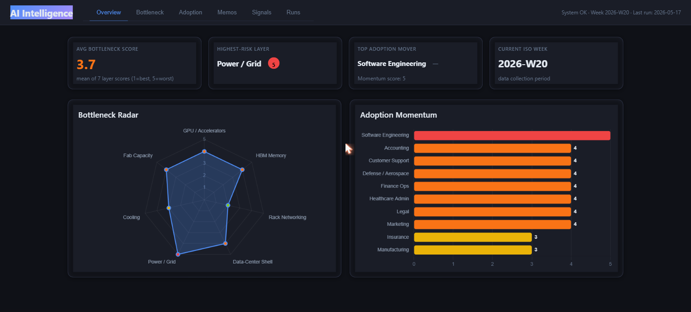
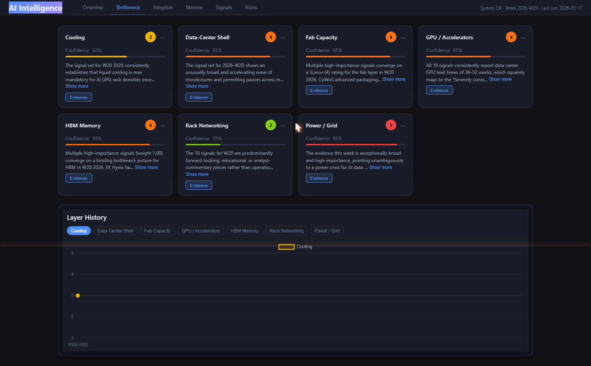
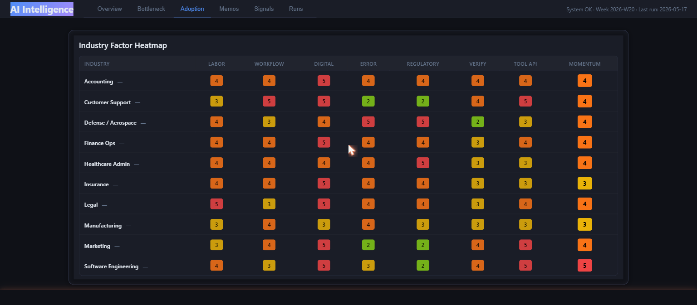
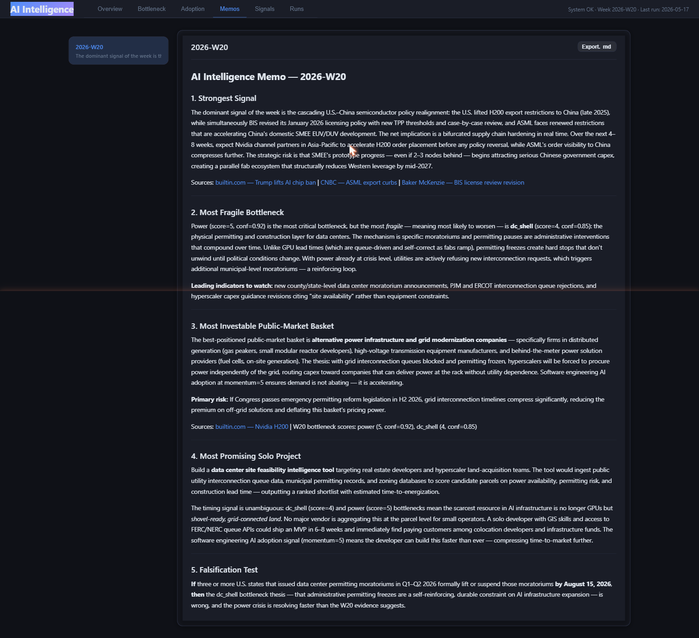
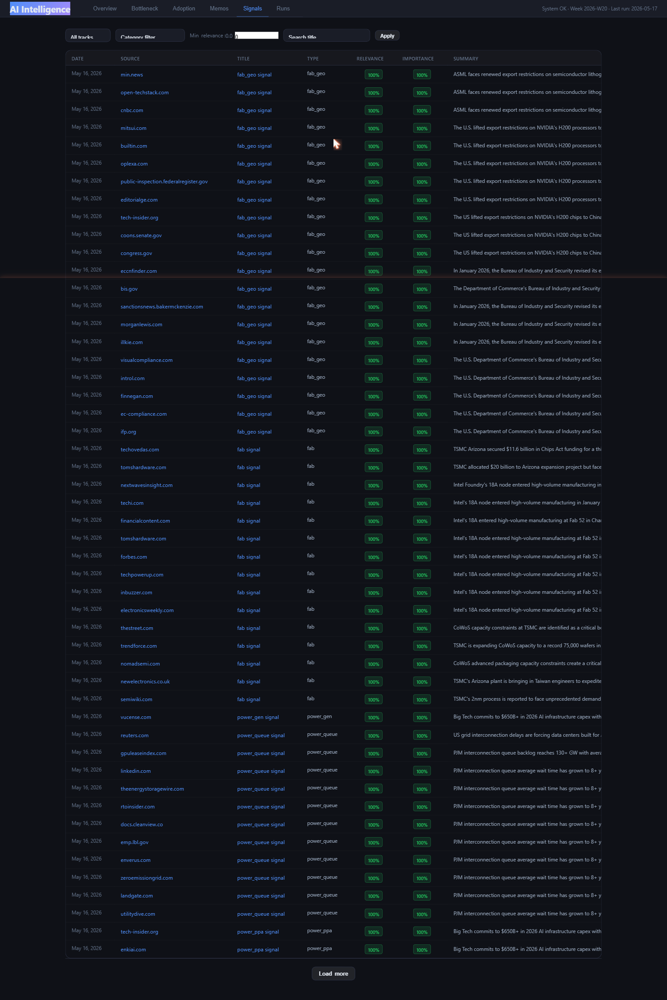

# AI Intelligence System

An autonomous weekly intelligence tracker that monitors the AI infrastructure stack and agent adoption across industries — scoring signals, tracking bottlenecks, and generating analyst memos. Runs locally, costs ~$1.50/month.



---

## What it does

Every week the system:

1. **Collects** ~600+ signals from DuckDuckGo search across 30 targeted signal types
2. **Classifies** each signal for relevance and importance using Claude Haiku
3. **Scores** two intelligence tracks using Claude Sonnet:
   - **AI Infrastructure Bottleneck Index** — 7 layers each scored 1–5 (1 = abundant, 5 = acute bottleneck)
   - **Agent Adoption Heatmap** — 10 industries × 7 structural factors, scored on momentum
4. **Synthesizes** a Friday analyst memo with the week's strongest signal, most fragile bottleneck, investable basket, and falsification test
5. **Serves** a local web dashboard with radar charts, heatmaps, trend history, and drill-down evidence

---

## The four-layer thesis

The system tracks a causal chain from the research framework:

```
AI infrastructure stack
        ↓
agentic software adoption
        ↓
services-industry compression
        ↓
energy / chip / geopolitical bottlenecks
```

The research question every week: **where is AI demand hitting the real world hard enough to create pricing power, institutional panic, or workflow redesign?**

---

## Track 1 — AI Infrastructure Bottleneck Index

Seven layers of the AI compute stack, each scored 1–5 weekly:

| Layer | Monitors |
|---|---|
| **GPU / Accelerators** | H100/H200/B200 lead times, hyperscaler allocation |
| **HBM Memory** | SK Hynix, Samsung, Micron capacity ramp |
| **Rack Networking** | NVLink, InfiniBand, 800G optics |
| **Data-Center Shell** | Permitting, siting, moratoriums, MW announcements |
| **Power / Grid** | Interconnection queues, PPAs, gas turbines, nuclear |
| **Cooling** | Liquid cooling adoption, thermal density constraints |
| **Fab Capacity** | TSMC/Intel/Samsung nodes, CHIPS Act, export controls |

**Scoring rubric (GPU example):**
- `1` = Abundant — lead times < 4 weeks
- `2` = Normal — lead times 4–12 weeks
- `3` = Tight — lead times 12–26 weeks, hyperscalers prioritized
- `4` = Severely constrained — lead times > 26 weeks, public allocation cuts
- `5` = Acute bottleneck — lead times 1yr+, capex plans revised due to supply

**Week 2026-W20 results:**

| Layer | Score |
|---|---|
| Power / Grid | 5/5 — acute |
| GPU, HBM, DC Shell, Fab | 4/5 — severely constrained |
| Cooling | 3/5 — emerging |
| Networking | 2/5 — manageable |

---

## Track 2 — Agent Adoption Heatmap

Ten industries scored on adoption momentum and seven structural factors:

**Industries:** Software Engineering, Legal, Accounting, Insurance, Healthcare Admin, Finance Ops, Marketing, Customer Support, Manufacturing, Defense / Aerospace

**Factors per industry:**

| Factor | What it measures |
|---|---|
| Labor Cost | How expensive is the human labor being replaced? |
| Workflow Repetitiveness | How structured and repeatable are the tasks? |
| Digital Artifact Availability | Are workflows already digital and API-accessible? |
| Error Cost | What's the cost of a mistake? |
| Regulatory Burden | How much compliance friction exists? |
| Verification Feasibility | How easy is it to check agent output? |
| Tool / API Access | Are relevant APIs and integrations already available? |

**Week 2026-W20 results:**

| Industry | Momentum |
|---|---|
| Software Engineering | 5/5 |
| Legal, Accounting, Healthcare, Finance, Marketing, Customer Support, Defense | 4/5 |
| Insurance, Manufacturing | 3/5 |

---

## Understanding the signal pipeline

### What are "641 signals collected"?

Each week the system runs ~110 targeted search queries across 30 signal types (e.g. `"H200 B200 GPU lead time hyperscaler 2026"`, `"legal AI agent law firm deployment Harvey 2026"`). DuckDuckGo returns up to 10 results per query. After deduplication by URL, the total unique articles/pages found becomes the raw signal count — **641 signals** in Week 2026-W20.

### What are "515 high-relevance signals"?

After collection, Claude Haiku reads each signal's title and snippet and scores it 0–1 on two dimensions:

- **Relevance** (0–1): Is this signal genuinely about the topic being tracked?
- **Importance** (0–1): Does it contain specific data points, not just opinions?

Signals with `relevance ≥ 0.5` are considered high-relevance — **515 signals** passed this threshold. These are the signals Claude Sonnet actually reads when producing bottleneck and adoption scores.

Filtered out: vendor press releases with no data, listicles, paywalled articles with only a headline visible, and recycled content older than 3 months.

### Why does this matter?

The classify step is the quality gate. Without it, Claude would score layers based on generic SEO content. With it, scoring is grounded in actual supply-chain updates, earnings commentary, government filings coverage, and research papers.

---

## Dashboard

Six tabs served at `http://127.0.0.1:5000`:

| Tab | Content |
|---|---|
| **Overview** | 4 KPI cards + bottleneck radar chart + adoption bar chart |
| **Bottleneck** | Score cards per layer with evidence drill-down + 12-week trend |
| **Adoption** | 10×7 factor heatmap + industry detail with radar chart |
| **Memos** | Weekly synthesis memos rendered as markdown |
| **Signals** | Filterable table of all 600+ raw signals |
| **Runs** | Collection history + "Run Now" trigger |

### Overview


### Bottleneck Index


### Agent Adoption Heatmap


### Weekly Memo


### Raw Signals


---

## Setup

### Requirements

- Python 3.10+
- Anthropic API key ([console.anthropic.com](https://console.anthropic.com))
- Perplexity API key (optional — DuckDuckGo is the free default)

### Install

```bash
git clone https://github.com/yourname/ai_intelligence_system
cd ai_intelligence_system
pip install -r requirements.txt
```

### Configure

```bash
cp .env.example .env
# Edit .env and add your ANTHROPIC_API_KEY
```

`.env` contents:
```
ANTHROPIC_API_KEY=sk-ant-...
PERPLEXITY_API_KEY=pplx-...        # optional
SEARCH_PROVIDER=duckduckgo          # or: perplexity
```

### First run

```bash
python run.py init-db       # create database
python run.py doctor        # verify API keys + connectivity
python run.py run-once      # collect + score + memo (~10-15 min)
python run.py serve --no-schedule   # start dashboard
```

Open **http://127.0.0.1:5000**

---

## Search providers

| Provider | Cost | Quality | Setup |
|---|---|---|---|
| **DuckDuckGo** (default) | Free | Good — scores from snippets | No key needed |
| **Perplexity sonar-pro** | ~$0.60/month | Better — full synthesized summaries with citations | `PERPLEXITY_API_KEY` required |

Switch providers by changing `SEARCH_PROVIDER` in `.env`. No code changes needed.

---

## CLI reference

```bash
python run.py init-db                    # initialize database (idempotent)
python run.py doctor                     # check API keys + connectivity
python run.py run-once                   # full pipeline: research → score → memo
python run.py run-once --track bottleneck --layer gpu   # single layer test
python run.py run-once --skip-memo       # research + score only
python run.py run-once --force           # overwrite this week's existing run
python run.py serve                      # start dashboard + weekly scheduler
python run.py serve --no-schedule        # start dashboard only (no auto-collection)
python run.py status                     # show last run + cost to date
python run.py costs --since 2026-01-01  # API cost breakdown
python run.py export-memo --week 2026-W20   # export memo as markdown
```

---

## Cost

| Component | Cost |
|---|---|
| DuckDuckGo search | Free |
| arXiv API | Free |
| Claude Haiku (classify ~30 batches/week) | ~$0.05/week |
| Claude Sonnet (score 17 calls + memo/week) | ~$0.30/week |
| **Total** | **~$1.50/month** |

Perplexity sonar-pro adds ~$0.60/month if enabled.

---

## Architecture

```
DuckDuckGo / Perplexity
        ↓
src/researcher.py      — fetches + classifies signals
        ↓
src/scorer.py          — scores layers + industries via Claude
        ↓
src/memo.py            — synthesizes weekly analyst memo
        ↓
data/intelligence.db   — SQLite storage (WAL mode)
        ↓
src/routes_api.py      — Flask JSON API
        ↓
static/js/*.js         — browser dashboard (no framework, no CDN)
```

---

## Data sources

- **DuckDuckGo** — web search across targeted queries for each signal type
- **arXiv API** — recent AI agent research papers (adoption track)
- **Claude Haiku** — relevance + importance classification
- **Claude Sonnet** — bottleneck scoring, adoption scoring, memo synthesis

All scoring uses `cache_control: ephemeral` prompt caching, reducing input token costs ~70%.

---

## Inspiration

This project was inspired by the podcast episode **"Anthropic's $1.2T Valuation, Leopold's $5.5B Fund, and the Compute Bottleneck | EP #255"** — which laid out the thesis that the AI race is becoming an industrial supply-chain race, with the constraint migrating from models to chips, power, and geopolitics.

[](https://www.youtube.com/watch?v=0hK__1vkqMg)

The research framework — the four-layer causal chain, weekly signal categories, bottleneck scoring rubrics, industry adoption heatmap, and 90-day execution plan — was distilled from that episode by **ChatGPT 5.5**, which turned the podcast thesis into an actionable intelligence system spec. Claude Code then built the system from that spec.

---

## License

MIT
